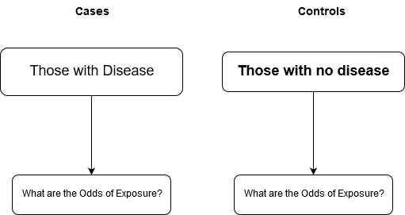
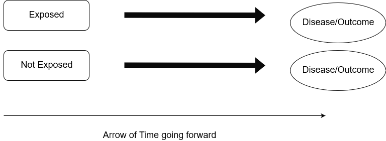
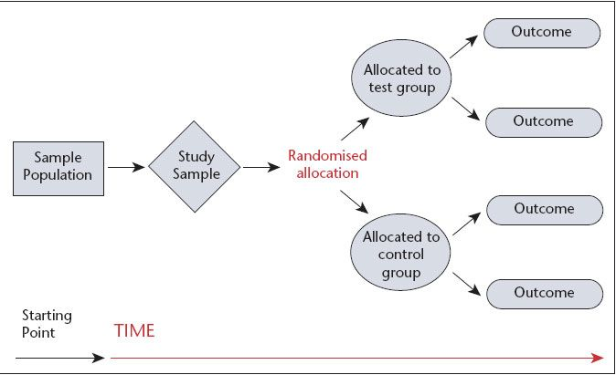

## Study designs in Evidence based health

--- 
## Challenge ...
You are a health officer working in a small town ("T") with 1000 residents. You have received reports from the doctors in the area that there is a gastroenteritis like outbreak, characterised by nausea, vomiting, and abdominal pain in the town. Your department head wants you to investigate this. What will be your first step and what will you do?

[Answer this question by clicking here](https://www.wooclap.com/STUDYDESIGNS)

---
## Case series
- In a case series, all 'cases' of a disease are studied in detail
- A case definition is set up to identify each case as it occurs
- A population is defined and the cases are studied and each case is followed up
- There is no comparison group
- A case series is good for description but not useful for causal research

---

## Challenge 2
You have now identified that there were 75 people who were affected with the gastroenteritis in your town, and you also found out by interviewing each of them that they had visited a newly opened cafe in the town that served a special meal. You want to find out what percent of people in the town visited the cafe. How will you find out?

[Answer this question here](https://www.wooclap.com/STUDYDESIGNS)

---

## Cross-sectional survey
- This is the study you would do to find out the frequency of people in a population with some characteristic
- For example, here the percentage of people in the town who would visit the cafe
- Using a cross-sectional survey, you can estimate the point or period prevalence of a disease or exposure
- You will measure the exposure and outcome at the same time
- Cross-sectional surveys are  not useful for causal research

---

## Indications of cross-sectional surveys
- As a preliminary investigation of a disease in a population
- As a first pass to identify the prevalence of an exposure in a population
- In order to assess prevalence of a disease

---

## Benefits of a cross-sectional survey
- Relatively inexpensive in terms of time and expenses
- Many disease conditions and exposures can be studied at the same time

---

## Disadvantages of a cross-sectional survey
- As you measure exposure and outcome at the same time, therefore
- You cannot assess a causal association only on the basis of a cross-sectional survey
- Risk of reverse causation, that the effect can lead to a 'cause'
- Example: In a cross-sectional survey, salt intake can be found to be lower among those with high blood pressure
- This can happen if those diagnosed with high blood pressure choose to consume less salt FOLLOWING their diagnosis but included in the survey
- Underestimation of the true prevalence

---

## Challenge 3
Following your investigation, you found that 40 people went to the Cafe since its opening; and you also found that 30 people suffered from gastroenteritis out of 40 who went to the Cafe and 10 out of 40 people who also went to the Cafe did NOT suffer from gastronenteritis. What is the prevalence of cafe attendance?

[Answer this question here](https://www.wooclap.com/STUDYDESIGNS)

---

## Measure of disease in a cross-sectional survey
- You measure prevalence in a cross-sectional survey
- Prevalence = (total number of people with exposure or outcome / Total number of people ) * base
- Example: in a study of 1000 people, 60 people had suffered from Asthma
- Prevalence of Asthma: (60 / 1000) * 100 (base population) = 6%

---

## Measure of disease risk in a cross-sectional survey
- Prevalence Odds Ratio
- Odds Ratio = Ratio of two odds
- Odds = Probability of an event / (1 - proabability of the Event)
- If the probability of an event is 0.10 (i.e., 10%), then 
- Odds of that event occurring: 10:90 (0.10 / (1 - 0.10) )
- As prevalence is a probability, therefore we can use prevalence

---

## Challenge 4

Now you know that out of 75 people who suffered from gastroenteritis, 30 people visited the cafe. What is the odds of suffering from gastroenteritis if a person were to visit the cafe?

[Answer here](https://www.wooclap.com/STUDYDESIGNS)

---

## Case control study
- You compare cases with controls
- Cases are those people with the diseease or the health outcome of interest
- Controls are people who are very similar to the cases but they do not have the disease or health outcome of interest
- Other than the health outcome, the controls and cases should be exactly similar, so that:
- If a control were to develop the disease condition, then the control would now become a case
- You sample people in a source population on the basis of their outcome status

---

## Representation of a case control study

---

## Example of a case control study data analysis

| Parameter | Cases | Controls | 
|:----------|:-----:|:--------:|
| Exposed   | 70    | 20       |
| Non-exposed | 130 | 180      |
| Total      | 200  | 200      |

---

## Notes on the previous case control study table
- 200 cases and 200 controls were studied
- They were sampled on the basis of whether they had the disease
- 70 out of 200 cases were exposed
- 20 out of 200 controls were exposed
- Odds of exposure for cases = 70 / 200: 130 / 200 = 70:130
- Odds of exposure for controls = 20 / 200: 180 / 200 = 20: 180
- Therefore Odds Ratio = (70:130) / (20:180) = (70 * 180) / (130 * 20) = 4.84

---

## Meaning and Interpretation of Odds Ratio
- Odds Ratio is a CROSS PRODUCT
- Odds Ratio is same as Relative Risk or Rate Ratio for rare diseases
- Rare disease = 1 in 10, 000 or less frequent
- It tells us that compared with controls, cases are OR times more likely to be exposed to the expposure variable
- In this example: exposure is a risk factor for the outcome, OR = 4.84
- Compared with the controls, cases were 4.8 times likely to be exposed

---

## Challenge 5

You have conducted a study on smoking and lung cancer and you find the following table

| Parameter | Lung Cancer | Absence of lung cancer |
|:----------|:-----------:|:----------------------:|
| Smokers   | 80          | 15                     |
| Non-smoker| 120         | 185                    |
| Total     | 200         | 200                    |
What is the Odds Ratio of Smoking with Lung Cancer?

[Answer here](https://www.wooclap.com/STUDYDESIGNS)

---

## Interpretation of Odds Ratio
- For exposure and disease outcome relationship, if the Odds Ratio > 1.00, 
- then the exposure is a risk factor for the disease
- For exposure and disease outcome, if the Odds Ratio is < 1.00,
- then the exposure is NOT a risk factor but a PROTECTIVE factor for the disease outcome

---

## Indication for Case control study
- Great for rare diseases
- You can study multiple exposures
- Relatively inexpensive in terms of time and resources
- Limited due to possibility of recall bias from the participants

---

## Challenge 6

You have a hypothesis that eating at the Cafe might be a risk factor for gastroenteritis in this population. You decide to set up a case control study to investigate it. You have included all 75 cases of gastroenteritis as your cases. Who will you select as your controls?

[Answer here](https://www.wooclap.com/STUDYDESIGNS)

---

## Principle of matching for case control studies
- Controls must match closely with the cases
- You must match controls and cases based on potential confounding variables for the association between the exposure of interest and the disease outcome
- Usually always match for age and gender for most diseases
- Use logistic regression for analysis of data

---

## Challenge 7

After some time, you began a case control study on restaurant attendance and gastroenteritis; meanwhile, more people started visiting the cafe: you conducted the study on 75 cases and 75 controls for eating out at the restaurant, you found the following data:

| Parameter | Cases | Controls |
|:----------|:-----:|:--------:|
| Exposed to Cafe | 40 | 38   |
| Did not visit Cafe | 35 | 37 |
| Total             | 75  | 75 |

Based on this data, what would you say about the risk of gastroenteritis for someone who consumed food or visited the Cafe?

---

## Cohort study design

- Where you sample individuals on the basis of their exposure status
- You FOLLOW UP people with and without exposure
- You estimate INCIDENCE RATE of the occurrence of disease/health outcome 
- Among exposed and non-exposed
- You compare the incidence rates of those with and without exposure
- You estimate the **Rate Ratio** as the Relative Risk
- Begin your study with ALL individuals FREE of the disease/outcome then follow up

---

## Graphical representation of Cohort study

---

## Measurement of health effects in cohort study
- Source population is measured in terms of person-years
- 1 person followed for 1 year = 1 person-year
- 100 people followed for 1 year = 100 person-years
- Incidence can be cumulative incidence after a fixed period of time
- Example 1000 people who worked in open plan workplace were followed for 5 years in a study
- Compared with 1000 people who worked in closed cubicles
- To study relative rates of anxiety related disorders in both groups
- Each group contributed 5000 person-years

---

## Measurement of effect size in cohort study
- Incidence among the exposed (E)
- Incidence among the non-exposed (NE)
- Attributable risk = E - NE 
- Rate Ratio = E / NE
- Among 5000 person-years of exposed 200 people developed anxiety disease
- Among 5000 person-years of non-exposed, 100 people developed anxiety disease
- Attributable risk = 200 - 100 = 100 per 5000 person-years
- Rate Ratio = 200 / 100 = 2.0

---

## Indication of cohort study
- Relatively fixed population (not too much migration/death)
- Common diseases
- When you need to study different diseases from common exposure
- Example: Christchurch Longitudinal study, Dunedin Longitudinal Study

---

## Limitation of cohort study
- Time consuming and expensive
- Risk of Selection Bias
- People can be differentially allocated to the exposure and non-exposure arm

---

## Methods of analysis of data
- Cox Proportional Hazards regression
- Poisson regression
- Longitudinal data analysis

---

## Challenge 8

You found that among those who were suffering from gastroenteritis, several worked in a local hospital and a laboratory that handled human and animal tissues and samples. You suspected that such work might be associated with the gastroenteritis rather than eating out at the Cafe. You decide to set up a cohort study. Who would be your exposed and who would be your non-exposed cohorts?

[Answer here](https://www.wooclap.com/STUDYDESIGNS)

---

## Interpretation of the results of Cohort studies
- A relative risk or rate ratio > 1.0 would mean that EXPOSURE is a RISK factor for the outcome
- A relative risk estimate LESS THAN 1.0 would mean that EXPOSURE is a PROTECTIVE factor for the outcome
- AR % = (RR - 1) * 100 / RR would mean Exposure would explain AR% of the Variation in disease risk
- Example: if a study on smwoking and heart disease were to report RR = 3.0, then this would indicate 
- Smoking was a risk factor for heart disease, AND
- (3 - 1) / 3 = 66.7% of heart disease risk was explained by smoking alone

---

## Challenge 9

You conducted the cohort study for 6 months and after six months, you found as follows:
- You studied 600 person-years in these 6 months for exposed group
- You studied 1000 person-years in these 6 months for the non-exposed group
- 20 cases of gastroenteritis were reported in the exposed group
- 20 cases of gastroenteritis were reported in the non-exposed group

Based on the above data, is working in the hospital and laboratory a risk factor for gastroenteritis in this population?

[Answer here](https://www.wooclap.com/STUDYDESIGNS)

---

## Randomised controlled trials
- Randomised controlled trials or RCTS are interventional study designs
- All people with disease are divided into two groups: one group would receive the intervention and the other group would receive the non-intervention
- The non-intervention can be: placebo, another drug/treatment, no treatment
- Both groups would then be followed up over time to note outcomes
- Outcomes are compared across both groups
- The groups are allocated to the treatment and control arms using randomisation procedure

---

## Randomised controlled trials graphic

---

## Why is randomized controlled trial a superior study design
- Random allocation ensures that all possible confounding variables are controlled for in the study design itself
- Random allocation eliminates selection bias
- The study design is prospective, all people in both arms of the study are followed up over time, hence cause and effect can be established
- To reduce response bias or measurement bias, RCTS are 'blinded'
- In blinding, the experienter or the participant would not be aware of the allocation status
- This is referred to as allocation concealment

---

## Limitation of RCT
- Expensive and time consuming
- The results are applicable to a narrow group of individuals who match the conditions of the study
- RCTs cannot be applied to observational studies such as toxic exposure

---

## Analysis of RCTs
- Rate of outcome among those who receive the treatment (Treatment-rate)
- Rate of outcome among those who will receive the alternative (Control-rate)
- Risk Difference (Attributable Risk) = Treatment-rate - Control-rate
- Rate Ratio or Risk Ratio or Relative Risk = Treatment-rate / Control-rate

---

## Example of an RCT

- In an RCT comparing drug D with placebo to test the efficacy of the drug D on palpitation, the investigators randomised 2000 people into two groups, and followed each group for 1 year (2000 person-years). They also tallied how many were symptom-free during this time period. The found the following:

| Group | Symptom-free | Total person-years | Rate of symptom free | Rate Ratio |
|-----------|:------------:|:-------------------:|:--------------------:|:---------:|
| Received Drug | 100      | 2000                | 0.05                 |           |
| Received placebo | 50    | 2000                | 0.025                |           |
| Total           | 150    | 4000                |                     | 2.0  |

---

## Measures of RCT (in this example)

- Attributable Risk (AR) = 0.05 - 0.025 = 0.025
- Numbers needed to treat = 1 / AR = 1 / 0.025 = 40
- Relative Risk = 2.0
- The drug D was 2.0 times effective compared with the placebo in reducing the symptoms 
- But, based on NNT, you'd have to treat 40 people before you could eliminate symptoms in 1 person with this drug as opposed to the placebo

---

## Conclusions
- In this module, you learned several study designs
- Case series, case control, cross-sectional surveys are good study designs for generating hypotheses
- Case control, cohort, and RCTs are good study designs for testing hypotheses
- From relatively inexpensive to more expensive: case-control > cohort study design > randomised controlled trials

